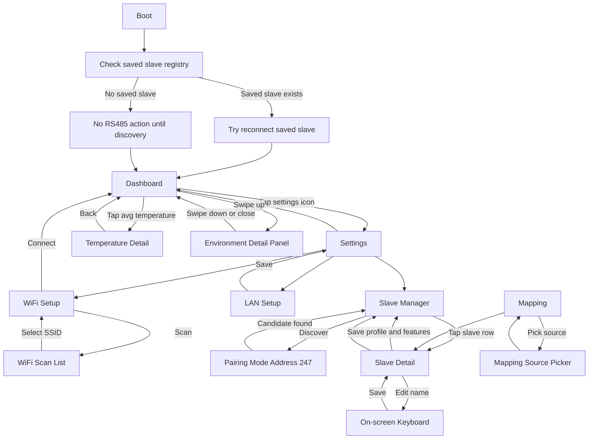
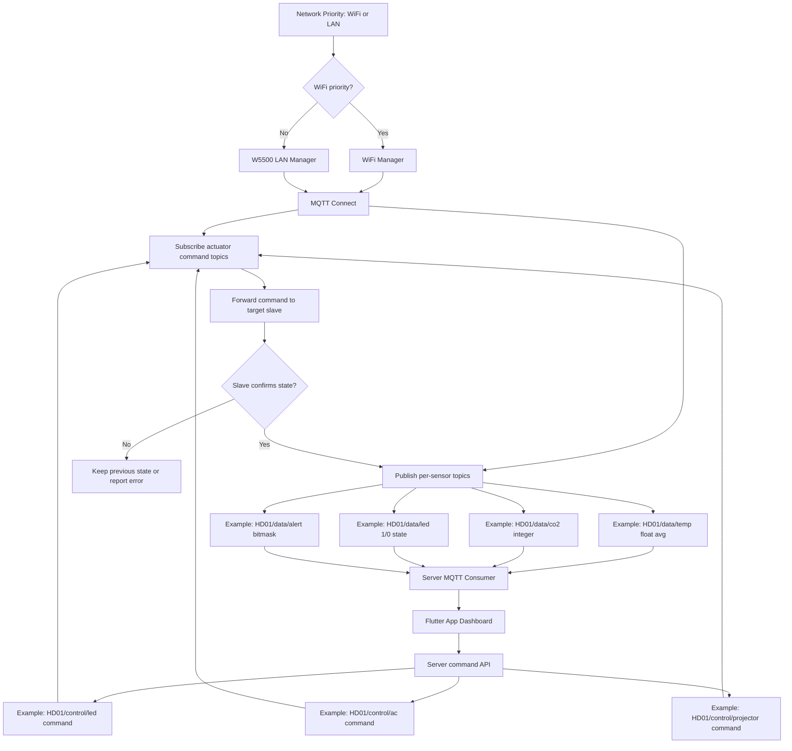
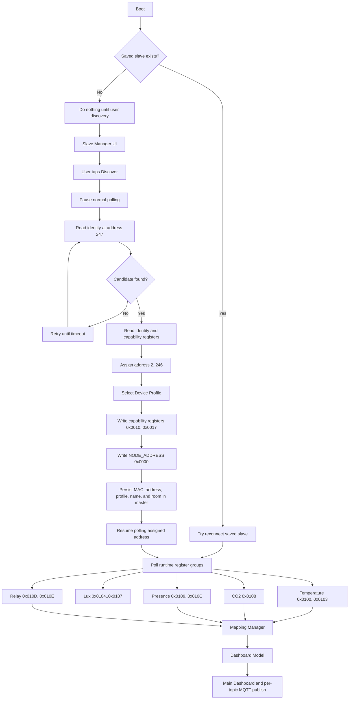

# Smart Building Serial Master

ESP32-S3 based master HMI for a smart building node network. This device is the central touchscreen controller for one room/class: it reconnects known RS485 slave nodes, reads room sensors, controls endpoints such as LED, AC, and projector, and publishes room data to a Flutter/mobile app through MQTT.

The firmware targets an ESP32-S3 N16R8 board with a 3.5 inch ILI9488 serial SPI display, XPT2046 resistive SPI touch, W5500 Ethernet, WiFi, MQTT, and an RS485 Modbus RTU field bus.

## What This Device Does

- Shows a 480x320 touchscreen dashboard for room status and control.
- Connects through WiFi or W5500 Ethernet.
- Publishes each sensor data type to its own MQTT topic for a Flutter app.
- Receives MQTT control commands for LED, AC, and projector topics.
- Talks to distributed slave nodes over RS485 Modbus RTU.
- Reconnects saved slaves first; discovery/pairing at Modbus address `247` is only needed for new or recovered slaves.
- Stores master-owned slave names, slave assignment, and dashboard mapping.
- Uses Firmware V2.1 slave rules: the master assigns a Device Profile while the slave stays policy-blind.
- Maps raw slave data into logical dashboard slots such as temperature, CO2, presence, Lux, LED, AC, and projector.

## Firmware V2 at a Glance

What changed: Firmware V2 moves away from one large MQTT state topic and multi-main-sensor slave assumptions.

Why: The new model keeps the app simpler, makes each sensor stream easier to subscribe to, and prevents one slave from being configured as unrelated sensor types at the same time.

Implementation effect:

- Startup checks saved slave configuration first. If saved slaves exist, the master tries to reconnect them. If no saved slave exists, it stays idle until the user starts discovery.
- MQTT publishes numeric data topics, for example `HD01/data/temp` and `HD01/data/co2`.
- Simple sensor topics use integer payloads, except temperature.
- Temperature publishes one float average Celsius value with one decimal place, for example `27.4`. When no temperature slot is valid, firmware skips the temperature publish and preserves the retained last-known value; Alert Bit 0 reports the invalid state.
- LED and projector publish integer `1` or `0`.
- AC uses the compact `PPTTFFSS` payload for power, target temperature, fan speed, and swing. AC target is clamped to `16..30` degrees Celsius.
- MQTT also publishes `HD01/data/alert` as a decimal bitmask and `HD01/data/active` as retained online state.
- MQTT delivery defaults are scalar data QoS 0 retain true, `active` LWT QoS 1 retain true, and actuator commands QoS 1 retain false.
- Control topics are subscribed separately, for example `HD01/control/led`, `HD01/control/ac`, and `HD01/control/projector`.
- After an actuator command is confirmed by the target slave, the master republishes the related state topic so the app can synchronize.
- Slave selection follows the v2.1 Device Profile model.

## MQTT Alert Bitmask

The master publishes one retained decimal integer to:

```text
HD01/data/alert
```

The integer is a bitmask. Add the active bit values together when more than one
condition exists.

| Bit | Decimal value | Meaning |
|---:|---:|---|
| 0 | 1 | No valid temperature source. |
| 1 | 2 | CO2 source invalid or unavailable. |
| 2 | 4 | Room Lux source invalid or unavailable. |
| 3 | 8 | Human-presence source invalid or unavailable. |
| 4 | 16 | RS485/bus problem affecting an available light relay. |
| 5 | 32 | Projector verification/hardware warning or projector bus problem. |
| 6 | 64 | AC control/bus error or AC cooling-performance warning. |
| 7 | 128 | After-hours empty-room active-load anomaly. |

Example:

```text
alert = 137
137 = 128 + 8 + 1
```

This means active-load anomaly, invalid presence, and invalid temperature are
active together. The server is responsible for decoding the decimal bitmask
before presenting human-readable warnings to the mobile app.

### AC Cooling-Performance Warning

Alert Bit 6 does not require the room to reach the configured AC target. A
target of `16 C`, for example, is treated as an AC command, not a promise that
the room itself will become `16 C`.

The master starts a conservative cooling-response check only when:

- the mapped AC control is available and continuously ON;
- at least one valid room-temperature source exists; and
- average room temperature is at least `2 C` above the AC target.

The master then observes a rolling 30-minute window. If average room
temperature drops less than `0.5 C`, Alert Bit 6 is raised. Turning AC OFF,
changing the target, losing valid temperature feedback, or reaching near-target
temperature resets the evaluation. A later valid cooling response clears the
warning automatically.

### Projector Lux Verification

BH1750/Lux feedback for the projector is optional. The projector ON/OFF command
always remains usable even when no Lux sensor is installed.

Only Lux channels physically exposed by the same mapped slave that owns
`PROJECTOR_IR` are allowed to verify the projector. Lux from DHT, room-sensor,
or any other slave is ignored by projector verification.

While the projector is OFF, the master continuously learns a slow-moving
ambient baseline for every valid Lux channel on that projector slave. After
Projector ON is requested, each channel is compared against its own baseline. A
channel verifies ON when either:

- its Lux increase reaches `clamp(baseline * 20%, 20 lx, 80 lx)`; or
- its reading reaches at least `1.25x` baseline with an increase of at least
  `15 lx`.

If at least one channel verifies ON, the projector remains ON. When another
expected channel is missing or unchanged, the UI shows `CHK LUX` so wiring or
sensor placement can be inspected without falsely marking the projector OFF.
The first verification window lasts up to 8 seconds. If no channel verifies ON,
the master retries the ON command once and opens another 8-second window. After
the second failed check it keeps the requested ON state, shows `CHK PROJ` for
10 seconds, and raises Alert Bit 5 during that warning period.

If no valid Lux channel exists, the command is sent normally and the UI shows
green `ON` with red `NO LUX`. Missing Lux never blocks projector control and is
not treated as projector failure by itself.

Lux verification currently confirms Projector ON only. Projector OFF follows
the requested IR/control state directly and does not wait for a Lux decrease,
because ambient sunlight and room lamps can keep Lux high after the projector
turns off.

If the mapped projector slave has no valid Lux, verification immediately uses
`NO LUX`; Lux available on another slave does not delay the projector command.
Room-Lux publishing remains independently controlled by the `LOGICAL_LUX_MAIN`
mapping. Projector-slave Lux is local-only verification data and never
contributes to `HD01/data/lux`; MQTT room Lux must come from another
non-projector Lux source.

## Lamp Control And Planned Verification

- The local master touchscreen exposes `LED 1` and `LED 2` separately.
- `LED 1` controls Relay 1 at `0x010D`; `LED 2` controls Relay 2 at `0x010E`.
- The mobile app/server exposes only one aggregate Lamp control.
- Every `HD01/control/led` command and schedule action controls Relay 1 and
  Relay 2 together.
- MQTT `HD01/data/led` remains an aggregate state: `1` means at least one lamp
  relay is ON; `0` means all lamp relays are OFF.
- MQTT LED commands are not published optimistically. The master writes the
  relay register, immediately reads Relay 1/2 back from the slave, then
  publishes the confirmed aggregate state to `HD01/data/led`.
- Lux is not required to confirm LED ON/OFF. If no Lux sensor is installed,
  relay-register readback still provides immediate ON/OFF confirmation.
- Remote LED commands are blocked only while presence feedback is valid and the
  room is confirmed occupied. Missing or invalid presence feedback raises its
  own alert but does not silently block an LED OFF command.
- A failed LED write or relay readback publishes the last confirmed cached
  relay state and raises Alert Bit 4 instead of falsely claiming the requested
  state succeeded.

Lux-based lamp verification is intentionally not active yet. A future checker
must not report lamp failure merely because sunlight changes, clouds pass, or
only one lamp zone is intentionally ON. Verification must map each relay to its
own Lux zone and use a persistent `INCONCLUSIVE` state before raising a warning.

## Patch Notes

### V2.8 Local Schedule and MQTT Timing

- Keeps fast RS485 sensor-block polling while MQTT uses event-driven updates and 5-minute heartbeats.
- Publishes temperature every 5 seconds for 5 minutes after AC ON or a target change of at least 1 C.
- Publishes non-projector room Lux on the MQTT connection snapshot and 5-minute heartbeat only.
- Splits only the local master touchscreen light control into `LED 1` and
  `LED 2`. The mobile app/server keeps one aggregate Lamp control; every
  `control/led` MQTT command and schedule action controls both configured light
  relays together.
- Records the next lamp-verification design without enabling it yet: window/weather changes and one-zone-only lighting must not become false lamp warnings.
- Plans logical separation between room Lux, projector-verification Lux, and Lux outlier detection while keeping the existing 5-7 day active-load anomaly.
- Keeps master authority over lamp commands while a room is confirmed occupied.
- Implements the local daily schedule engine: validates and stores `YYYYMMDD;HHMM-HHMM;...`, overwrites the previous schedule, triggers pre-class actions 20 minutes early, starts smart shutdown at class end, and catches up after reboot.
- Every valid daily schedule payload immediately replaces the previous stored
  schedule, even if one or more old schedule slots have not happened yet.
- Adds conservative AC cooling-performance monitoring through Alert Bit 6
  without requiring room temperature to reach the AC setpoint.
- Full implementation status and remaining Lux work: `docs/V2.8_Planning.md`.

### V2.7.1

- **Projector Adaptive Verification Target**: Refines the V2.7 projector check from a fixed Lux delta into an adaptive per-channel baseline algorithm. While the projector is OFF and one or more Lux channels are valid, the master learns the room ambient baseline per channel. When Projector ON is requested, it compares each post-warmup Lux channel against its own baseline using a hybrid threshold such as `max(20 lx, min(80 lx, baseline * 0.20))` plus a ratio guard. If no BH1750/Lux channel is installed or valid, the command still behaves as normal IR ON/OFF and is marked `NO LUX`, not failed.
- **Projector Warning Semantics**: If at least one Lux channel proves the projector turned on but another expected Lux channel is missing or unchanged, the projector stays ON and the UI shows `CHK LUX`. If no channel proves ON after one retry, the projector still stays ON but shows `CHK PROJ` and raises Alert Bit 5. The master no longer auto-publishes OFF just because one-way IR verification failed.
- **Daily Schedule Payload Target**: `HD01/control/schedule` will support a daily overwrite payload from the server, for example `20260609;0800-0930;1015-1200;1330-1500`. Every valid daily payload replaces the previous stored schedule and resets that day's trigger flags, so the server can send one schedule around midnight and the master can run it locally if MQTT/server availability drops later.
- **Scheduler Safety Clarification**: Occupancy-based shutdown should only trust `human_presence` when the presence value is valid. If the shutdown timer expires while the room is still occupied, the master should recheck on a slow interval such as 5 minutes instead of continuously evaluating the expired timer.
- **Anomaly Alert Baseline Fix**: Alert Bit 7 (128) is defined as after-hours empty-room active-load anomaly. The alert should require valid time, valid occupancy, enough historical days, and a meaningful baseline. Recommended trigger: `active_load_minutes > max(avg_7d * 1.5, avg_7d + 60)` during 22:00-06:00 when the room is confirmed empty.

### V2.7

- **Legacy Projector Verification**: V2.7 originally used a fixed BH1750
  ambient-light delta and could fall back to OFF after failed verification.
  This behavior is superseded by the V2.7.1 adaptive per-channel verification
  described above; current firmware never marks the projector OFF solely
  because optional Lux feedback did not verify one-way IR control.
- **Occupancy Safety Overrides (Acceptation Level)**: Restricts remote MQTT commands when human presence is detected (`human_presence == true`). Ignores remote light ON/OFF commands and remote AC OFF commands to prevent remote scripts from disrupting active classes. Remote AC temperature adjustments, fan speed, swing mode, and local HMI touchscreen controls always bypass this constraint.
- **Scheduler & Smart Shutdown**: Subscribes to and parses `"PRE_CLASS_ON"` (turns ON AC and lights immediately, clearing pending shutdown timers) and `"CLASS_ENDED"` (starts 20-minute empty room shutdown timer) on `control/schedule`. When the timer expires, turns off lights and AC only if the room is empty (`human_presence == false`).
- **7-Day Rolling Lamp Anomaly Alerting**: Logs daily active lamp minutes. Rollover occurs at midnight via NTP time and persists to NVS circular buffer `light_history_min[day_count % 7]`. Triggers Alert Bit 7 (128) if today's duration exceeds the 7-day average by $1.5\times$ during after-hours (22:00-06:00) when the room is empty (`human_presence == false`).

### V2.6.1

- Updates MQTT topic structure and payload formatting.
- Updates alert handling and alert topic behavior.

### V2.6

- Updates MQTT formatting for clearer per-topic payloads and improved broker command handling.
- Updates the slave contract documentation to align V2.6 RS485 register behavior with the current master/slave protocol.
- Enables AC swing and fan speed control in this version, with swing and fan settings supported end-to-end.

### V2.4

- Replaces the direct MQTT broker keyboard shortcut with a dedicated MQTT Setup summary screen.
- Shows broker host, port, TLS mode, username, masked password, and connection status before editing.
- Persists MQTT broker, port, TLS mode, username, and password in ESP32-S3 NVS and reconnects using the saved values.
- Makes each MQTT field editable only after its card is tapped.
- Loads the last saved WiFi SSID and password from NVS whenever WiFi Setup is opened.
- Keeps WiFi credentials synchronized with the latest connection request.
- Updates FSD and UI/UX documentation for the V2.3 dashboard layout and V2.4 network setup behavior.

### V2.3

- Fixes saved-slave profile selection accidentally clearing all capability assignments and causing the dashboard to show `No Device Active`.
- Releases stale manual dashboard mappings when their saved slave was removed or replaced, while preserving mappings for temporarily offline known slaves.
- Restores saved Device Profile and assignment registers after automatic known-slave recovery.
- Forces one immediate sensor refresh after recovery so restored temperature data becomes visible without waiting for the normal polling cycle.
- Adds profile-driven Slave Detail rows, profile unselect behavior, and saved-slave delete/forget support.
- Improves the adaptive dashboard layout for AC + Projector and Temperature + AC + Projector combinations.
- Enlarges AC temperature `UP` / `DOWN` touch targets while keeping the AC power button compact.
- Adds temporary dashboard-only Swing and Fan cycling controls. These controls are UI dummy states until the RS485 slave contract defines their registers.
- Adds direct RS485 relay debug command support and aligns AC target writes with the current x10 register format.
- Updates Firmware V2.1 recovery, mapping, UI/UX, architecture, and slave-contract documentation.

### V2.2

- Keeps the WiFi scan stability fix from V2.1.
- Simplifies Settings page 2 into the older row-based device settings layout.
- Moves detailed device name and class room editing back into the Device Info screen.

### V2.1

- Fixes WiFi scan busy/start-failed conflicts during reconnect and scan flows.
- Adds the horizontal two-page Settings layout with MQTT and device info controls.

## Hardware Overview

| Part | Detail |
|---|---|
| MCU | ESP32-S3 N16R8 |
| Display | ILI9488 3.5 inch TFT, 480x320, serial SPI |
| Touch | XPT2046 resistive SPI touch, shared TFT SCK/MOSI/MISO, CS GPIO46 |
| Ethernet | W5500 on dedicated SPI2 bus |
| Field bus | RS485 through MAX3485, Modbus RTU, 19200 8N1 |
| Framework | Arduino with PlatformIO |

## Main Firmware Modules

| Module | Responsibility |
|---|---|
| `src/ui_screens.*` | Dashboard, Settings, WiFi, LAN, Slave Manager, Mapping UI |
| `src/display.*` | LovyanGFX display setup and pin mapping |
| `src/touch.*` | Resistive SPI touch polling and gesture events |
| `src/wifi_manager.*` | WiFi credentials, reconnect, async scan |
| `src/lan_manager.*` | W5500 Ethernet setup and link state |
| `src/mqtt_manager.*` | MQTT per-topic publish/subscribe, sensor payloads, and actuator commands |
| `src/rs485_manager.*` | RS485 Modbus master, pairing, polling, control writes |
| `src/mapping_manager.*` | Slave registry to dashboard logical model |
| `src/data.*` | Shared `BuildingState` and persistence |

## UI Flow



## Connectivity Flow - MQTT



Firmware V2.5 generates these exact runtime topics from the saved class name using
`<class_name>/data/<data_type>` and `<class_name>/control/<command_type>`.
Actuator state and command traffic are separated so the server can consume
lightweight numeric state and send commands without self-echo ambiguity.

## Connectivity Flow - RS485 Modbus

The current agreed slave wire contract is:

`docs/From_SLave/RS485_Modbus_Slave_Firmware_Contract v2.md`



## RS485 Contract Summary

| Register group | Address |
|---|---|
| Pairing/default slave address | `247` |
| Capability/profile registers | `0x0010..0x0017` |
| Address assignment | `0x0000` |
| Config/status registers | `0x00F0..0x00F3` |
| Recovery MAC and address | `0x00F4..0x00F7` |
| Temperature | `0x0100..0x0103` |
| Lux | `0x0104..0x0107` |
| CO2 | `0x0108` |
| Presence | `0x0109..0x010C` |
| Relay | `0x010D..0x010E` |
| AC 1 control/status | `0x0200..0x0202`, `0x0206`, `0x0208..0x020A` |
| AC 2 control/status | `0x0203..0x0205`, `0x0207`, `0x020B..0x020D` |
| Projector control/status | `0x0210..0x0212` |

Firmware V2 slave configuration effect:

- Master owns Device Profile selection and persistence.
- Profiles include `TEMP_NODE`, `PRESENCE_NODE`, `CO2_NODE`, `RELAY_NODE`, and `IR_COMBO_NODE`.
- `IR_COMBO_NODE` may expose AC 1, AC 2, and Projector on one IR slave.
- Slave firmware remains RAM-only and policy-blind.

## Build

Install PlatformIO, then run:

```bash
# EDIT_TARGET: README.md - Build
# EDIT_PURPOSE: Show PlatformIO build command
# EDIT_REASON: Developers need a quick command to compile firmware locally
pio run
```

Upload to the connected ESP32-S3:

```bash
# EDIT_TARGET: README.md - Upload
# EDIT_PURPOSE: Show PlatformIO upload command
# EDIT_REASON: Developers need a quick command to flash the ESP32-S3 target
pio run -t upload
```

Open serial monitor:

```bash
# EDIT_TARGET: README.md - Serial Monitor
# EDIT_PURPOSE: Show PlatformIO serial monitor command
# EDIT_REASON: Developers need a quick command to inspect firmware logs
pio device monitor -b 115200
```

## Documentation

Start with [docs/README.md](docs/README.md).

Important docs:

- [Functional Specification](docs/FSD_Smart_Building_Master_UPDATED.md)
- [UI/UX Specification](docs/UIUX.md)
- [RS485 Modbus Architecture](docs/Smart_Building_RS485_Modbus_Architecture.md)
- [Connectivity and Dashboard Mapping](docs/Smart_Building_Connectivity_Dashboard_Mapping_Design_UPDATED.md)
- [Flutter MQTT Requirements](docs/Flutter_App_MQTT_Requirements.md)
- [Current Slave Contract](<docs/From_SLave/RS485_Modbus_Slave_Firmware_Contract v2.md>)

## Current Notes

- Master owns slave names, feature enable state, and dashboard mapping.
- Startup must check saved slave data before discovery. Saved slaves are reconnected first; if none exist, firmware does not auto-assign anything.
- Slave firmware stays RAM-only for address/capability config; master persists MAC to address mapping.
- Firmware V2.1 slave selection uses master-owned Device Profiles.
- Temperature MQTT payload is one float average Celsius value with one decimal place. Invalid temperature is not published as `-1`; firmware preserves the retained last-known value and raises Alert Bit 0.
- LED and projector MQTT payloads use integer `1` or `0`.
- Simple sensor MQTT payloads use integers unless their specific contract says otherwise; temperature uses a one-decimal float.
